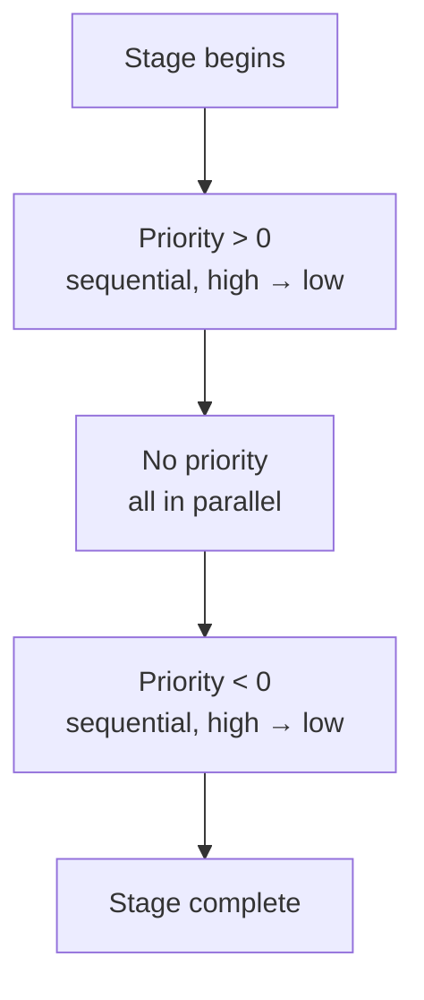

Within a single stage, callbacks execute in three groups, in this order:

1. **Positive priority** — `priority > 0`, run sequentially from highest to lowest
2. **No priority** — `priority === undefined`, run in parallel
3. **Negative priority** — `priority < 0`, run sequentially from highest to lowest (i.e. `-1` before `-100`)



## Examples

```typescript
// Runs first in Bootstrap, before everything else in this stage
lifecycle.onBootstrap(connectDatabase,   1000);

// Runs with other unprioritized Bootstrap callbacks, in parallel
lifecycle.onBootstrap(loadInitialData);
lifecycle.onBootstrap(startMetrics);
lifecycle.onBootstrap(warmCaches);

// Runs last in Bootstrap, after all others
lifecycle.onBootstrap(logBootComplete,   -1);
```

## Why sequential for prioritized callbacks?

Unprioritized callbacks are assumed to be independent and are awaited with `Promise.all`. Prioritized callbacks are assumed to have explicit ordering requirements — so they run with `await` in sequence to guarantee A completes before B starts.

## Practical patterns

**Ensure a connection is ready before dependent services initialize:**

```typescript
// In DatabaseService
lifecycle.onBootstrap(async () => {
  await pool.connect();
}, 100); // high positive priority — runs before lower-priority Bootstrap callbacks

// In CacheService (which needs the db connection)
lifecycle.onBootstrap(async () => {
  const warmData = await db.query("SELECT ...");
  cache.set("initial", warmData);
});
// No priority — safe to run after db has connected (assuming both are in same module
// and db has priority)
```

**Ensure something runs absolutely last in a stage:**

```typescript
lifecycle.onReady(() => {
  logger.info("all ready callbacks have run");
}, -1000);
```
