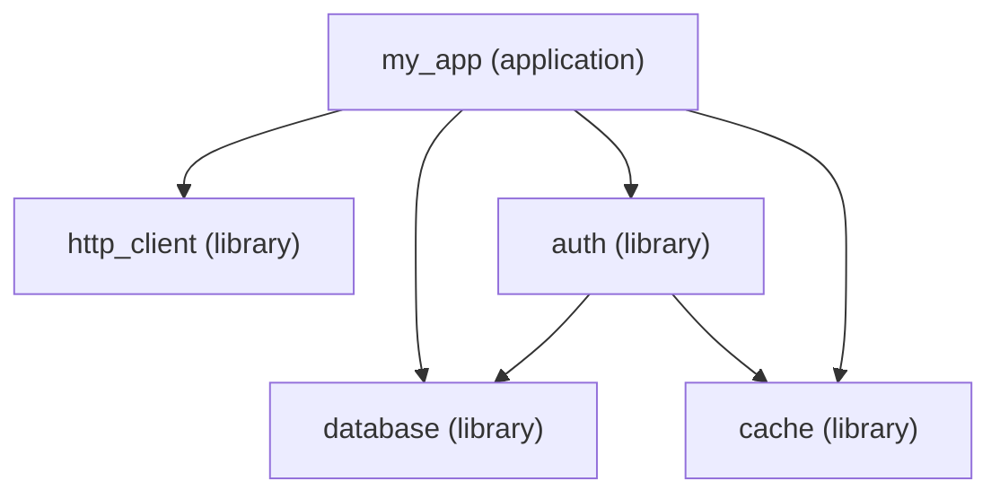

A small Digital Alchemy app fits in three files. A larger one needs a structure that's easy to navigate and scale. This guide covers patterns for organizing real applications.

## The basic shape

At minimum, every application has:

- A definition file: `CreateApplication`, `LoadedModules` declaration, exports
- Service files: one service per file, named after what it does
- An entrypoint: imports the definition file, calls `bootstrap()`

```
src/
├── app.mts                  # CreateApplication + LoadedModules
├── main.mts                 # bootstrap() call
├── services/
│   ├── api.service.mts
│   ├── database.service.mts
│   └── cache.service.mts
└── types/
    └── index.mts            # shared TypeScript types
```

## Service naming

Name service files after what they do, not what they are. `users.service.mts` is better than `user-manager.service.mts`. The service key in `CreateApplication` should match the filename:

```typescript
export const MY_APP = CreateApplication({
  name: "my_app",
  services: {
    users:    UsersService,    // src/services/users.service.mts
    orders:   OrdersService,   // src/services/orders.service.mts
    database: DatabaseService, // src/services/database.service.mts
    cache:    CacheService,    // src/services/cache.service.mts
  },
});
```

The service key is what other services use to access it: `my_app.users.create(...)`. Keep keys short and noun-like.

## When to extract a library

A library is warranted when:

- Multiple applications need the same code
- A set of services forms a cohesive, independently-testable unit
- You want to publish the services as a package

A library is not warranted when the code is only used by one application. Premature extraction adds ceremony without benefit.

## Module dependency graph

A real application typically looks like:



Libraries with `depends` declare their dependencies explicitly. The framework resolves the load order: `database` and `cache` first (no dependencies), then `auth` (depends on both), then `http_client`, then the application.

## Multiple entrypoints

Keep the application definition separate from bootstrap calls:

```
src/
├── app.mts            # definition
├── main.mts           # production bootstrap
├── dev.mts            # dev bootstrap (debug logging, verbose config)
└── scripts/
    ├── migrate.mts    # database migration bootstrap
    └── seed.mts       # test data seed bootstrap
```

Each entrypoint imports `MY_APP` and calls `bootstrap()` with different options:

```typescript title="src/dev.mts"
import { MY_APP } from "./app.mts";
await MY_APP.bootstrap({
  configuration: {
    boilerplate: { LOG_LEVEL: "debug" },
    my_app: { DATABASE_URL: "postgres://localhost/dev" },
  },
});
```

```typescript title="src/scripts/migrate.mts"
import { MY_APP } from "./app.mts";
await MY_APP.bootstrap({
  bootLibrariesFirst: true,  // ensure DB is ready before app services wire
  configuration: {
    my_app: { DATABASE_URL: process.env.MIGRATE_DB_URL },
  },
});
// post-bootstrap: run migrations
await MY_APP.teardown();
```

## Configuration organization

For larger apps, consider a configuration module that provides a typed interface over the raw config:

```typescript
export function ConfigService({ config }: TServiceParams) {
  return {
    get database() {
      return {
        url: config.my_app.DATABASE_URL,
        poolSize: config.my_app.DB_POOL_SIZE,
        ssl: config.my_app.DB_SSL,
      };
    },
    get server() {
      return {
        port: config.my_app.PORT,
        host: config.my_app.HOST,
      };
    },
  };
}
```

Other services destructure `my_app.config.database.url` instead of reading raw config. This centralizes config key names and makes refactoring config entries easier.

## Test structure

Mirror the source structure:

```
src/
└── services/
    ├── users.service.mts
    └── orders.service.mts

test/
├── services/
│   ├── users.test.mts
│   └── orders.test.mts
└── mocks/
    ├── database.mock.mts
    └── cache.mock.mts
```

Mocks live in `test/mocks/` as `CreateLibrary` instances with the same name as the real library. Tests import the mock and pass it to `TestRunner.replaceLibrary()`.
