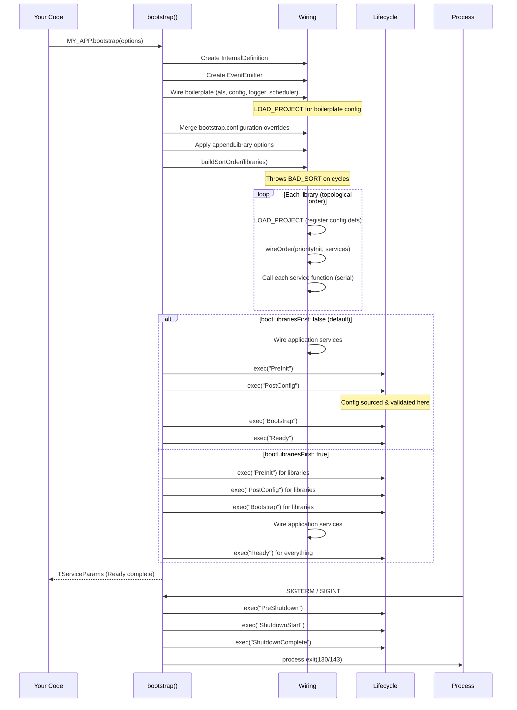

When you call `MY_APP.bootstrap()`, a lot happens before your first `onReady` callback fires. This guide walks through every phase.

## The full sequence

## Phase 1 — Boilerplate

Before any user code runs, four boilerplate services are wired: `als` (AsyncLocalStorage), `configuration`, `logger`, and `scheduler`. These form the basis of `TServiceParams` — every subsequent service gets access to them.

The boilerplate module's config definitions are also registered via `LOAD_PROJECT`. This happens before any library code runs, so boilerplate config keys like `LOG_LEVEL` and `NODE_ENV` are always available.

After boilerplate wiring, any overrides from `bootstrap.configuration` are merged in. These have the highest priority — they override everything, including env vars and config files.

## Phase 2 — Dependency sorting

`buildSortOrder()` runs a topological sort on `app.libraries`. It repeatedly selects the next library whose dependencies are all already in the output list. The result is a deterministic load order.

This runs before any library services are wired. A `BAD_SORT` error here means circular dependencies — fix the structure, not the code.

If `appendLibrary` was passed in `BootstrapOptions`, those libraries are merged into `app.libraries` before sorting.

## Phase 3 — Library wiring

Libraries wire in topological order. For each library:
1. `LOAD_PROJECT` registers its config definitions (defaults applied immediately)
2. `wireOrder(priorityInit, services)` determines the service wiring sequence
3. Each service function is called once, serially, receiving a `TServiceParams` built from everything wired so far

**What's in `TServiceParams` during library wiring:**
- All boilerplate services (`logger`, `config`, `scheduler`, `als`)
- All services from previously-wired libraries
- `config.*` with defaults (not yet env/argv/file values)

## Phase 4 — Application wiring (default mode)

The application's services wire the same way as library services. By this point, all library services are available in `TServiceParams`.

`priorityInit` controls the order within the application module — same algorithm as libraries.

## Phase 5 — Lifecycle stages

After all services are wired, the lifecycle runs four stages in sequence. The framework awaits each stage before starting the next.

**PreInit:** Runs before config is sourced from external sources. Only defaults are available in `config.*`. Use for registering custom config loaders or very early setup.

**PostConfig:** Config is sourced and validated here. The `initialize()` function in the configuration service runs the env/argv loader and file loader, then calls `validateConfig()`. If any `required: true` entry has no value, `REQUIRED_CONFIGURATION_MISSING` is thrown. All `onPostConfig` callbacks run after validation.

**Bootstrap:** All services are wired and config is validated. This is the main initialization stage — open connections, load data, start background processes.

**Ready:** Application is fully started. Safe to serve traffic, accept connections, and start scheduled jobs. The `scheduler` service activates at this stage — jobs registered before `Ready` didn't fire, and now start on their first scheduled time.

## What's in RAM at Ready

At `Ready`, every service's return value is accessible. The `internal.boot.loadedModules` map contains all modules, each with all their service return values. `internal.boot.completedLifecycleEvents` contains `["PreInit", "PostConfig", "Bootstrap", "Ready"]`.

No service function will ever be called again. The service return values are immutable (though the objects they point to can change state). The dependency graph is fixed.

## Shutdown

Shutdown is triggered by `SIGTERM`, `SIGINT`, or `app.teardown()` directly. The process:

1. All active `sleep()` calls are killed (`ACTIVE_SLEEPS` set is drained)
2. `PreShutdown`, `ShutdownStart`, `ShutdownComplete` run in that order
3. The event emitter's listeners are removed
4. If triggered by signal, `process.exit()` is called with the appropriate exit code

On `SIGTERM` → exit 143. On `SIGINT` → exit 130. On bootstrap failure → exit 1. On clean teardown without signal → process exits naturally.

## Why wiring is separate from lifecycle

This is the central design decision. During wiring, service functions run and return their APIs. At that moment, `TServiceParams` is built incrementally as each service completes. The return values of not-yet-wired services are `undefined`.

By keeping wiring and lifecycle separate, `priorityInit` can control the dependency order within a module, and `depends`/`libraries` can control it between modules. By the time lifecycle stages run, every service's API is fully available.

If wiring and `onBootstrap` were the same thing, you'd need a way to declare "my bootstrap callback depends on service X's bootstrap callback completing first" — a much harder problem. The current model eliminates that entire class of initialization ordering bugs.
