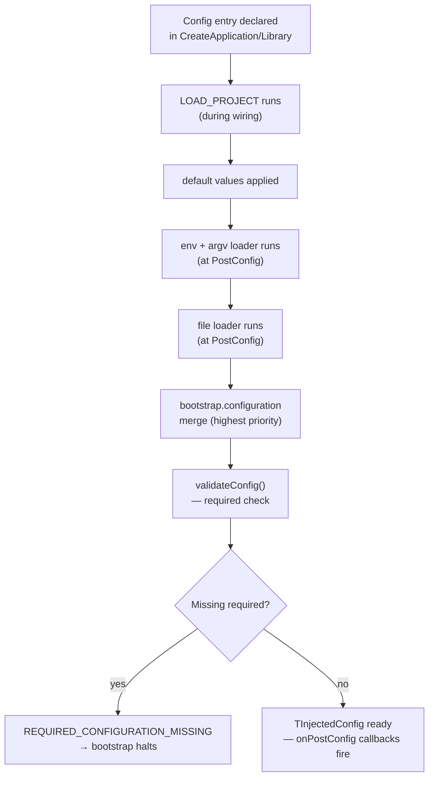

## The full config flow



## Source priority

Later sources in the merge order override earlier ones:

1. **`default`** — declared in the config entry
2. **env / argv** — environment variables and CLI flags (merged together in one pass)
3. **file** — `.env` file or the file specified by `--config`
4. **`bootstrap.configuration`** — highest priority; overrides everything

This means you can always override any config value at bootstrap time, regardless of what env says.

## Environment variable format

```
MODULE_NAME__KEY_NAME=value
```

Both the module name and key name are all uppercase, separated by a double underscore (`__`).

| Config entry | Env var |
|---|---|
| `my_app.DATABASE_URL` | `MY_APP__DATABASE_URL` |
| `my_lib.BASE_URL` | `MY_LIB__BASE_URL` |
| `boilerplate.LOG_LEVEL` | `BOILERPLATE__LOG_LEVEL` |

## Multi-environment patterns

The most reliable pattern: use `bootstrap.configuration` to inject environment-specific defaults, and rely on environment variables for per-deployment values.

```typescript title="src/main.mts  (production)"
await MY_APP.bootstrap({
  configuration: {
    boilerplate: { LOG_LEVEL: "warn" },
    my_app: { ENVIRONMENT: "production" },
  },
});
```

```typescript title="src/dev.mts  (development)"
await MY_APP.bootstrap({
  configuration: {
    boilerplate: { LOG_LEVEL: "debug" },
    my_app: { ENVIRONMENT: "local", PORT: 3001 },
  },
});
```

```bash
# In production, real values come from environment:
MY_APP__DATABASE_URL=postgres://prod-db/myapp
MY_APP__API_KEY=real-key
```

```bash
# In development, .env file provides local values:
MY_APP__DATABASE_URL=postgres://localhost/dev
MY_APP__API_KEY=dev-test-key
```

## Secret management

Use `required: true` without a `default` for secrets. This gives a clear boot failure if the secret is missing:

```typescript
DATABASE_URL: {
  type: "string",
  required: true,
  // no default
},
API_KEY: {
  type: "string",
  required: true,
},
```

In production: inject secrets via environment variables (`MY_APP__DATABASE_URL=...`). Don't hardcode secrets in config files or `bootstrap.configuration`.

In tests: provide test values via `.configure()`:

```typescript
runner.configure({
  my_app: {
    DATABASE_URL: "postgres://localhost/test",
    API_KEY: "test-key",
  },
});
```

## Restricting config sources

Use `source: ["env"]` on sensitive entries to ensure they can only come from environment variables — not accidentally set via a config file committed to version control:

```typescript
SECRET_KEY: {
  type: "string",
  required: true,
  source: ["env"],  // only settable via environment, never from file or argv
}
```

## Config in tests

Tests don't load env vars or config files by default. All config values come from `default` declarations or `.configure()`:

```typescript
// In test: required entries must be provided explicitly
await TestRunner(MY_APP)
  .configure({
    my_app: { DATABASE_URL: "postgres://test", API_KEY: "test" },
  })
  .run(async ({ config }) => {
    // config.my_app.DATABASE_URL === "postgres://test"
  });
```

This makes tests deterministic regardless of the environment.

## Reacting to runtime config changes

If you use programmatic config updates (e.g., feature flags from a config service), subscribe to changes:

```typescript
export function FeatureService({ internal, lifecycle }: TServiceParams) {
  lifecycle.onBootstrap(() => {
    internal.boilerplate.configuration.onUpdate((project, property) => {
      if (project === "my_app" && property === "FEATURE_FLAGS") {
        updateFeatureFlags(config.my_app.FEATURE_FLAGS);
      }
    });
  });
}
```

Updates emit `"event_configuration_updated"` on the event bus and trigger `onUpdate` callbacks.
