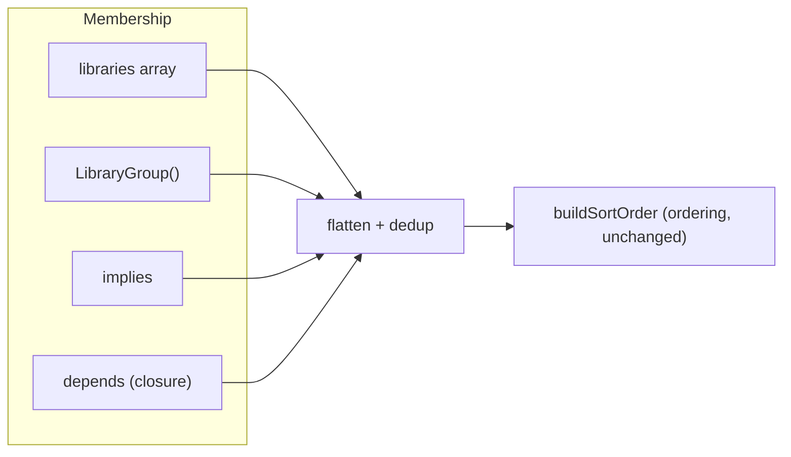
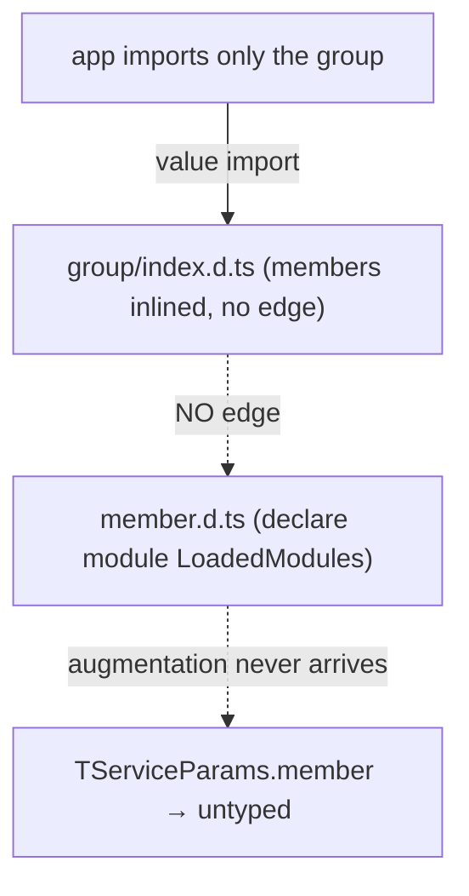

As an application grows into plugin-like groups — each group itself several libraries — the hand-maintained `libraries` array becomes a single flat union of *every* library plus *every* transitive dependency. This guide covers the opt-in primitives that make that list compositional, the three-way distinction between `depends`, `implies`, and `optionalDepends`, and the one typing rule you must follow for composed types to work across package boundaries.

## Two axes: membership and ordering

Bootstrapping needs two distinct things from you, and they are orthogonal:

1. **Membership** — *which* libraries exist. This is the resolved library set that the bootstrap engine flattens before wiring. It must be complete: `buildSortOrder` throws `MISSING_DEPENDENCY` for any `depends` target not reached through membership.
2. **Ordering** — *what wires before what*. This is each library's own `depends` / `optionalDepends`, topologically sorted.

In the redesigned model, `depends` **contributes membership** (closure-as-membership): every library in a `depends` list is transitively pulled into the wired set, so you no longer hand-list transitive base libraries in the app's `libraries` array.



## `depends`, `implies`, and `optionalDepends` — one bit of difference

All three can contribute to membership; they differ by exactly one bit — whether they add an **ordering edge**:

| | Contributes membership | Adds ordering edge | Typed on `params` | Missing = error |
|---|:---:|:---:|:---:|:---:|
| `depends` | ✅ (transitive closure) | ✅ | ✅ (`const` tuple capture) | ✅ |
| `implies` | ✅ | ❌ | ✅ (`const` tuple capture) | — |
| `optionalDepends` | ❌ | ✅ (if present) | ❌ | — |

**`depends`** is the primary primitive. Use it when your library actively calls into a peer — the ordering edge guarantees the peer wires first, and the closure-as-membership guarantee means consumers do not need to list the peer themselves.

**`implies`** is the niche "membership without an ordering edge" escape hatch. Use it when loading library X should always pull in libraries Y and Z, but X does not call Y or Z at wiring time and therefore does not care when they wire.

**`optionalDepends`** orders if the library is already present (from another `depends` path), but does not pull it into membership and leaves it untyped. Use for optional integrations your service must handle being absent.

```typescript
export const LIVING_ROOM = CreateLibrary({
  name: "living_room",
  depends: [LIGHTING],          // ordering + membership + types; LIGHTING wires first
  implies: [SCENES],            // membership + types; no ordering constraint
  optionalDepends: [AUDIO],     // order if present; no pull; untyped
  services: { Scenes },
});
```

A realistic library that must call into a peer on wiring uses `depends`. `implies` is for bundling passengers that don't need to be ready before the carrier wires.

## `LibraryGroup`

`LibraryGroup` replaces the former `RollupLibraries`. It composes several libraries into a membership unit, with an optional name and an optional generated registry service.

```typescript
import { LibraryGroup, CreateApplication } from "@digital-alchemy/core";

// unnamed group — membership only, no DI identity
const analyticsPlugin = LibraryGroup({
  members: [ANALYTICS_INGEST, ANALYTICS_API, ANALYTICS_STORE],
});

// named group — earns a LoadedModules key and a config.<name> namespace
const analyticsPlugin = LibraryGroup({
  name: "analytics",
  members: [ANALYTICS_INGEST, ANALYTICS_API, ANALYTICS_STORE],
});

// registry group — named + generates a priorityInit registry service
const ANALYTICS_GROUP = LibraryGroup({
  name: "analytics",
  registry: "registry",
  members: [ANALYTICS_INGEST, ANALYTICS_API],
});
// Members self-register via:
// lifecycle.onPreInit(() => parent.analytics.registry.register(...))
```

### `name` and `LoadedModules`

A named group earns a `LoadedModules` key and reserves a `config.<name>` namespace. An unnamed group is still a valid membership unit — it just has no DI identity.

### `registry` option — the plugin-registry pattern

When `registry` is provided (requires `name`), `LibraryGroup` synthesizes a carrier library that hosts a `priorityInit` registry service. Each member is shallow-cloned with `depends: [carrier]` appended so the registry is always wired before any member reads it. The generated service exposes `register(item)` / `list()`:

```typescript
export const ANALYTICS_GROUP = LibraryGroup({
  name: "analytics",
  registry: "registry",
  members: [ANALYTICS_INGEST, ANALYTICS_API],
});

// In a member's service:
export function IngestService({ analytics, lifecycle }: TServiceParams) {
  lifecycle.onPreInit(() => {
    analytics.registry.register({ name: "ingest", ... });
  });
}

// In a consumer:
export function RouterService({ analytics }: TServiceParams) {
  const all = analytics.registry.list();
}
```

## Dedup, diamonds, and cycles

- **Identity dedup.** Members must be module-singleton exports (not constructed inline), so the same library reached through two groups or two `depends` paths collapses to one.
- **Diamonds are fine.** When a shared base library is reached via two paths, it is deduped and boot emits a hygiene `warn` — consider declaring it a shared base dependency. With `showExtraBootStats`, the manifest shows every member and the path(s) that brought it in.
- **Same name, different object → `DUPLICATE_LIBRARY`.** Two distinct objects sharing a name is a broken install — the error names both copies and points at `yarn dedupe`. The framework does not arbitrate between versions; the singleton-held-globally contract is deliberate.
- **Cycles → `COMPOSITION_CYCLE`.** A group that transitively contains itself, or a mutual `implies`/`depends` chain.

## The cross-package typing rule

This is the part that bites silently if ignored.

`TServiceParams` is built from the global `LoadedModules` interface, which each library extends via declaration merging. A `declare module` augmentation only takes effect when the file containing it is part of the consumer's compilation.

When a downstream app imports **only a group** (not each member directly), TypeScript **inlines** the members' anonymous types into the group's emitted `.d.ts` with **no module edge** back to the member files. The members' own `LoadedModules` augmentations therefore never reach the consumer:



The result is "runtime works, types vanish": the services wire and run, but `params.member` is not typed.

### Type priority

Directly-listed libraries and named-group members always have their `LoadedModules` augmentations applied directly. `LoadedRollups` is a **fallback** channel — it fills keys not already present from a direct listing. If a library is listed both directly and via a group, the direct listing wins.

### The fix: register on `LoadedRollups`

Add a second declaration-merge, parallel to `LoadedModules`, in the module that defines the group. The member shapes are inlined into **this** augmentation, which travels because the consumer imports the group value:

```typescript title="analytics/src/index.mts"
export const analyticsPlugin = LibraryGroup({
  name: "analytics",
  members: [ANALYTICS_INGEST, ANALYTICS_API],
});

declare module "@digital-alchemy/core" {
  export interface LoadedRollups {
    analytics: {
      analytics_ingest: typeof ANALYTICS_INGEST;
      analytics_api: typeof ANALYTICS_API;
    };
  }
}
```

`@digital-alchemy/core` folds every `LoadedRollups` entry into `TServiceParams`, so `params.analytics_ingest` is fully typed downstream — even when the app imports only `analyticsPlugin`.

:::tip `depends` and `implies` carry types automatically — with named `function` services
Both `depends` and `implies` are captured as `const` tuples on `LibraryDefinition` (via a type parameter). The carrier's emitted `.d.ts` references each dependency and each implied member by `typeof import("./member.mjs").Service` — **a real module edge**, not an inlined anonymous shape. The member's own `LoadedModules` augmentation rides that edge into any consumer that imports only the carrier, so `params.<member>` is **typed and wired** with no `LoadedRollups` block and no re-export.

The catch: it works only when the dependency's / implied library's services are literal named `function` declarations.

```typescript title="analytics/src/store.mts"
// ✅ named function declaration → emits `typeof import(...).Ingest`: a real edge
export function Ingest({ logger }: TServiceParams) { /* ... */ }
export const ANALYTICS_STORE = CreateLibrary({ name: "analytics_store", services: { Ingest } });
```

An arrow (or anonymous / function-expression) service is serialized structurally inline with **no** import edge, so its augmentation never travels — `params.<member>` is untyped even though it wires at runtime:

```typescript
// ❌ arrow service → inlined anonymously, no edge → types do NOT travel through depends/implies
export const ANALYTICS_STORE = CreateLibrary({
  name: "analytics_store",
  services: { Ingest: ({ logger }: TServiceParams) => ({ /* ... */ }) },
});
```

If a depended-on or implied member must ship arrow/anonymous services, fall back to the `LoadedRollups` mechanism — register the bundle on `LoadedRollups` in the carrier's module, exactly as shown above.
:::

### Membership-only consequence

A library delivered **only** via an unnamed group or via `implies` has no `LoadedModules` key, so it gets service APIs on `TServiceParams` but **no** typed `config.<member>` and **no** `levelOverrides` entry. Its runtime config still loads. If you need typed config for a member, list it directly.

## Related

- [LibraryGroup](../reference/libraries/rollup-libraries) — API reference
- [CreateLibrary `implies` / `depends`](../reference/libraries/create-library) — the membership fields
- [Dependency Graph](../reference/libraries/dependency-graph) — ordering, which composition leaves untouched
