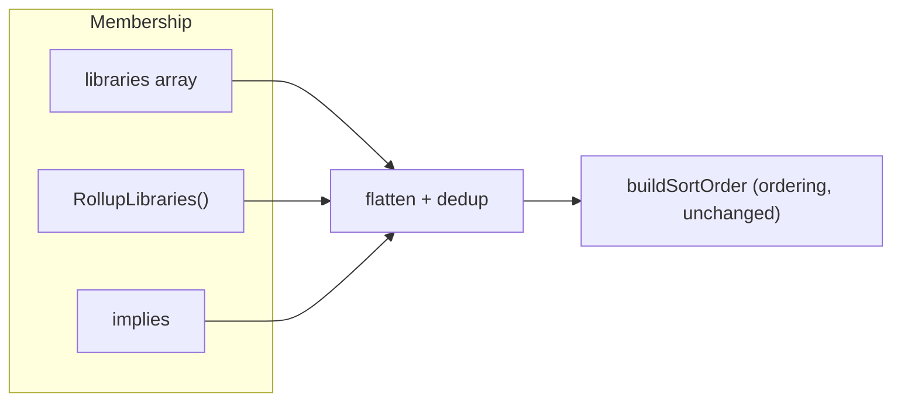
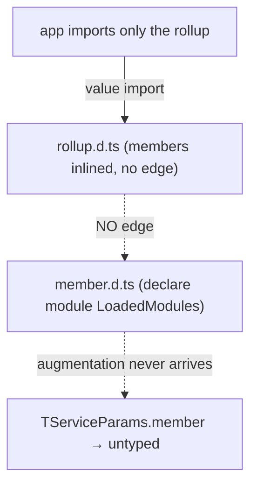

As an application grows into plugin-like groups — each group itself several libraries — the hand-maintained `libraries` array becomes a single flat union of *every* library plus *every* transitive dependency. This guide covers the two opt-in primitives that make that list compositional, and the one typing rule you must follow for them to work across package boundaries.

## Two axes: membership and ordering

Bootstrapping needs two distinct things from you, and they are orthogonal:

1. **Membership** — *which* libraries exist. This is the application's `libraries` array. It must be **complete and flat**: `buildSortOrder` throws `MISSING_DEPENDENCY` for any `depends` target not present.
2. **Ordering** — *what wires before what*. This is each library's own `depends` / `optionalDepends`, topologically sorted.

`depends` does **not** pull a library into membership — it declares an ordering edge and is *validated* against the membership list. The two composition primitives below add to **membership**; neither touches ordering.



## `RollupLibraries` vs `implies`

Both feed the same flatten-then-dedup resolver; they solve adjacent problems and are not substitutes.

| | [`RollupLibraries`](../reference/libraries/rollup-libraries) | [`implies`](../reference/libraries/create-library) |
|---|---|---|
| What it is | A **nameless** composition value | A field on a **named** library |
| Use when | You want to bundle N libraries as a composable unit nobody injects | Loading library X should always bring libraries Y, Z |
| Identity | None — no `LoadedModules` key, no DI node | Rides on the carrier library's identity |

```typescript
// a group authored once, as a composable unit
export const analyticsPlugin = RollupLibraries(
  [ANALYTICS_INGEST, ANALYTICS_API, ANALYTICS_STORE],
  { label: "analytics" },
);

// or: a library that always drags its bundle along
export const ANALYTICS_FRONT = CreateLibrary({
  name: "analytics_front",
  implies: [ANALYTICS_STORE, ANALYTICS_API],
  services: { ... },
});
```

## Dedup, diamonds, and cycles

- **Identity dedup.** Members must be module-singleton exports (not constructed inline), so the same library reached through two rollups collapses to one.
- **Diamonds are fine.** When a shared base library is reached via two groups, it is deduped and boot emits a hygiene `warn` — consider declaring it a shared base dependency. With `showExtraBootStats`, the manifest shows every member and the path(s) that brought it in.
- **Same name, different object → `DUPLICATE_LIBRARY`.** Two distinct objects sharing a name is an error, the same as listing a duplicate directly.
- **Cycles → `COMPOSITION_CYCLE`.** A rollup that transitively contains itself, or a mutual `implies` chain.

## The cross-package typing rule

This is the part that bites silently if ignored.

`TServiceParams` is built from the global `LoadedModules` interface, which each library extends via declaration merging. A `declare module` augmentation only takes effect when the file containing it is part of the consumer's compilation.

When a downstream app imports **only a rollup** (not each member directly), TypeScript **inlines** the members' anonymous types into the rollup's emitted `.d.ts` with **no module edge** back to the member files. The members' own `LoadedModules` augmentations therefore never reach the consumer:



The result is "runtime works, types vanish": the services wire and run, but `params.member` is not typed.

:::caution This affects the current array-spread workaround too
Spreading plain library arrays (`libraries: [...groupA]`) has the same limitation — it only appears to work when the app *also* imports each library directly.
:::

### The fix: register on `LoadedRollups`

Add a second declaration-merge, parallel to `LoadedModules`, in the module that defines the rollup. The member shapes are inlined into **this** augmentation, which travels because the consumer imports the rollup value:

```typescript title="analytics/src/index.mts"
export const analyticsPlugin = RollupLibraries([ANALYTICS_INGEST, ANALYTICS_API]);

declare module "@digital-alchemy/core" {
  export interface LoadedRollups {
    analytics: {
      analytics_ingest: typeof ANALYTICS_INGEST;
      analytics_api: typeof ANALYTICS_API;
    };
  }
}
```

`@digital-alchemy/core` folds every `LoadedRollups` entry into `TServiceParams`, so `params.analytics_ingest` is fully typed downstream — even when the app imports only `analyticsPlugin`.

:::tip `implies` carries types automatically — with named `function` services
`implies` is the **easier** case, not the same one. Unlike a nameless rollup, `CreateLibrary` captures `implies` as a `const` tuple (a third type parameter on `LibraryDefinition`), so the implier's emitted `.d.ts` references each implied member by `typeof import("./member.mjs").Service` — **a real module edge**, not an inlined anonymous shape. The member's own `LoadedModules` augmentation rides that edge into any consumer that imports only the implier, so `params.<member>` is **typed and wired** with no `LoadedRollups` block and no re-export.

The catch is the **same one** that determines whether a rollup member's types inline anonymously: it works only when the implied library's services are literal named `function` declarations.

```typescript title="analytics/src/store.mts"
// ✅ named function declaration → emits `typeof import(...).Ingest`: a real edge
export function Ingest({ logger }: TServiceParams) { /* ... */ }
export const ANALYTICS_STORE = CreateLibrary({ name: "analytics_store", services: { Ingest } });
```

An arrow (or anonymous / function-expression) service is serialized structurally inline with **no** import edge, so its augmentation never travels — `params.<member>` is untyped even though it wires at runtime:

```typescript
// ❌ arrow service → inlined anonymously, no edge → types do NOT travel through implies
export const ANALYTICS_STORE = CreateLibrary({
  name: "analytics_store",
  services: { Ingest: ({ logger }: TServiceParams) => ({ /* ... */ }) },
});
```

If an implied member must ship arrow/anonymous services, fall back to the rollup mechanism — register the bundle on `LoadedRollups` in the implier's module, exactly as shown above for a rollup.
:::

### Membership-only consequence

A library delivered **only** via a rollup has no `LoadedModules` key, so it gets service APIs on `TServiceParams` but **no** typed `config.<member>` and **no** `levelOverrides` entry. Its runtime config still loads. If you need typed config for a member, list it directly (or have it augment `LoadedModules` itself).

## Related

- [RollupLibraries](../reference/libraries/rollup-libraries) — API reference
- [CreateLibrary `implies`](../reference/libraries/create-library) — the membership field
- [Dependency Graph](../reference/libraries/dependency-graph) — ordering, which composition leaves untouched
