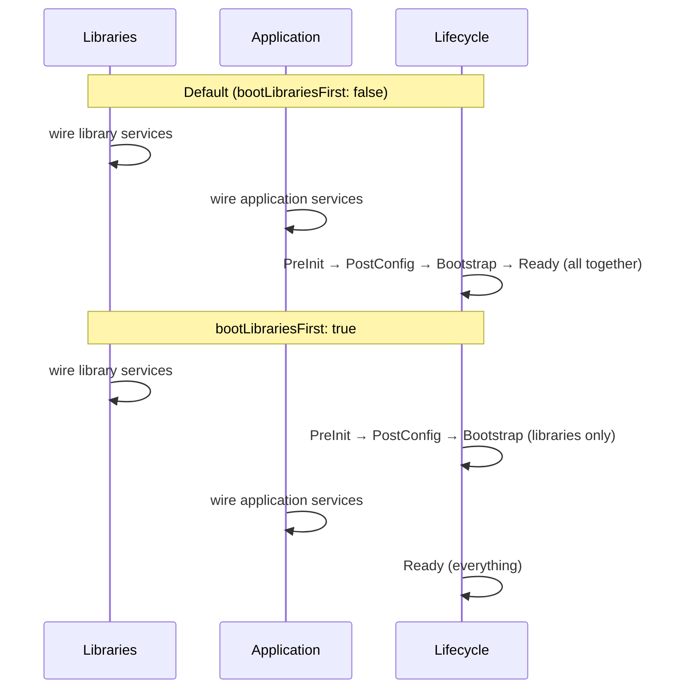

`bootstrap()` accepts an optional `BootstrapOptions` object. All fields are optional.

```typescript
await MY_APP.bootstrap({
  configuration: { boilerplate: { LOG_LEVEL: "debug" } },
  bootLibrariesFirst: true,
  loggerOptions: { mergeData: { env: "production" } },
});
```

## Options reference

| Field | Type | Default | Description |
|---|---|---|---|
| `configuration` | `PartialConfiguration` | — | Override config values at highest priority |
| `bootLibrariesFirst` | `boolean` | `false` | Boot libraries through Bootstrap before wiring app services |
| `appendLibrary` | `TLibrary \| TLibrary[]` | — | Add extra libraries after construction |
| `appendService` | `ServiceMap` | — | Add extra services to the application |
| `loggerOptions` | `LoggerOptions` | — | Fine-tune the built-in logger |
| `customLogger` | `GetLogger` | — | Replace the built-in logger entirely |
| `handleGlobalErrors` | `boolean` | `true` | Catch uncaught exceptions and unhandled rejections |
| `showExtraBootStats` | `boolean` | `false` | Print per-service construction times after boot |
| `envFile` | `string` | `".env"` | Path to `.env` file for config sourcing |
| `configSources` | `Partial<Record<DataTypes, boolean>>` | all `true` | Enable/disable specific config loaders |

### `configuration`

Provides config values at the highest priority — overrides env, argv, and file sources. Uses the same `PartialConfiguration` type as `.configure()` in `TestRunner`.

```typescript
await MY_APP.bootstrap({
  configuration: {
    boilerplate: { LOG_LEVEL: "warn" },
    my_app: { DATABASE_URL: "postgres://localhost/mydb", PORT: 5432 },
  },
});
```

### `bootLibrariesFirst`

By default, all services (library and application) are wired first, then lifecycle stages run for everything together. With `bootLibrariesFirst: true`, the sequence changes:



Use `bootLibrariesFirst: true` when application services need library resources (a database connection, a cache client) to be fully established before their own service function body runs — not just before a lifecycle callback.

### `appendLibrary` / `appendService`

Adds libraries or services that weren't declared in the original `CreateApplication` call. Useful for test helpers, plugins, or runtime-determined extensions. If a name collides with an existing library or service, the appended version takes priority.

### `loggerOptions`

Fine-tune the built-in logger without replacing it. See [Project Tuning](../../advanced/project-tuning.md) for all `LoggerOptions` fields.

```typescript
loggerOptions: {
  mergeData: { env: process.env.NODE_ENV, host: hostname() },
  ms: true,
  counter: false,
}
```

### `customLogger`

Replace the built-in logger with your own implementation. Must implement the `GetLogger` interface. Useful for integrating with external logging systems (Datadog, OpenTelemetry).

### `configSources`

Disable specific config loaders. By default all sources are enabled. Setting a source to `false` prevents that loader from running.

```typescript
configSources: {
  env: false,  // ignore environment variables
  argv: false, // ignore command-line arguments
}
```

## Process exit codes

The framework registers `SIGTERM` and `SIGINT` handlers automatically. On signal receipt, it runs the full shutdown sequence then exits with the appropriate code:

| Event | Exit code |
|---|---|
| Bootstrap error | `1` (`EXIT_ERROR`) |
| `SIGINT` (Ctrl+C) | `130` |
| `SIGTERM` | `143` |

Normal application exit (all lifecycle callbacks complete without error) does not call `process.exit()` — the Node.js process exits naturally.

## Common errors

| Error cause | What it means |
|---|---|
| `DOUBLE_BOOT` | `bootstrap()` called on an already-running application |
| `BAD_SORT` | Circular dependency between libraries |
| `MISSING_DEPENDENCY` | A library's `depends` entry is not in the app's `libraries` array |
| `REQUIRED_CONFIGURATION_MISSING` | A `required: true` config entry has no value at `PostConfig` |
| `MISSING_PRIORITY_SERVICE` | A name in `priorityInit` doesn't exist in `services` |
