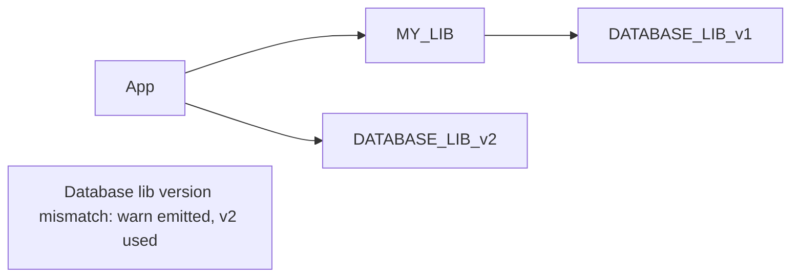
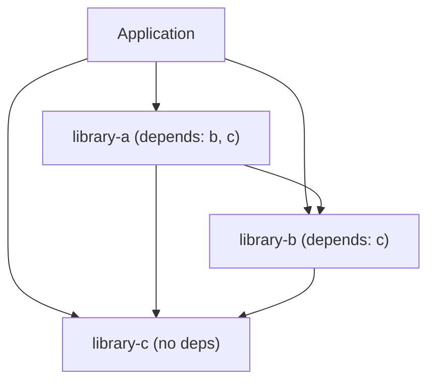

When an application has multiple libraries, the framework must wire them in dependency order — a library must be ready before any library that depends on it is wired. This is handled by `buildSortOrder()`.

## How it works

`buildSortOrder()` runs a topological sort on the libraries in `app.libraries`. It works by repeatedly finding the next library whose dependencies are all already in the output list:

```
Given: [A depends on C, B depends on C, C has no deps]
Step 1 → C has no deps, output it first: [C]
Step 2 → A and B both satisfied, output next available: [C, B]
Step 3 → A satisfied: [C, B, A]
```

The sort runs at boot, before any services are wired. Errors here are fatal and immediate.

## BAD_SORT — circular dependency

`BAD_SORT` is thrown when the sort cannot find a next library to load — which only happens when there's a cycle:

```
A depends on B
B depends on A
→ neither can be loaded first → BAD_SORT
```

**How to diagnose:** Look at which libraries are in the error's `current` list (already sorted) and which ones remain. The cycle is between the remaining libraries.

**How to fix:** Break the cycle. If A and B genuinely depend on each other, extract the shared functionality into a third library C that neither A nor B imports.

:::caution There is no lazy resolution
`BAD_SORT` is a hard error. The framework does not use proxies or deferred imports. Circular dependencies are detected immediately at boot and must be resolved structurally.
:::

## MISSING_DEPENDENCY — hard dep not in libraries

`MISSING_DEPENDENCY` is thrown when a library has `depends: [X]` but `X` is not in the application's `libraries` array:

```typescript
// MY_LIB requires DATABASE_LIB
export const MY_LIB = CreateLibrary({
  name: "my_lib",
  depends: [DATABASE_LIB],  // hard dependency
  services: { ... },
});

// APPLICATION doesn't include DATABASE_LIB → MISSING_DEPENDENCY at boot
export const MY_APP = CreateApplication({
  libraries: [MY_LIB],   // ← DATABASE_LIB missing!
  services: { ... },
});
```

**Fix:** Add the missing library to `libraries`:

```typescript
export const MY_APP = CreateApplication({
  libraries: [DATABASE_LIB, MY_LIB],
  services: { ... },
});
```

`optionalDepends` entries are exempt — they log a message and continue if absent.

## Version mismatch

If the application includes the same library twice (directly and transitively), the framework emits a `warn` log and uses the version declared directly in the application's `libraries` array. No error is thrown.



## Example dependency graph



Load order: `C` → `B` → `A` → Application services.
