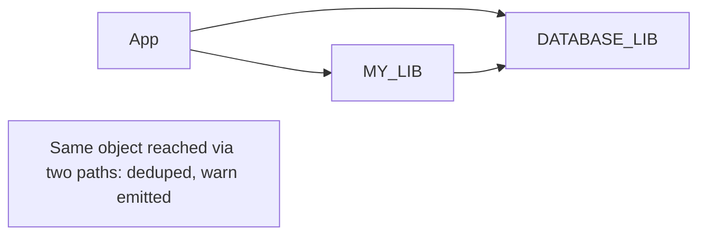
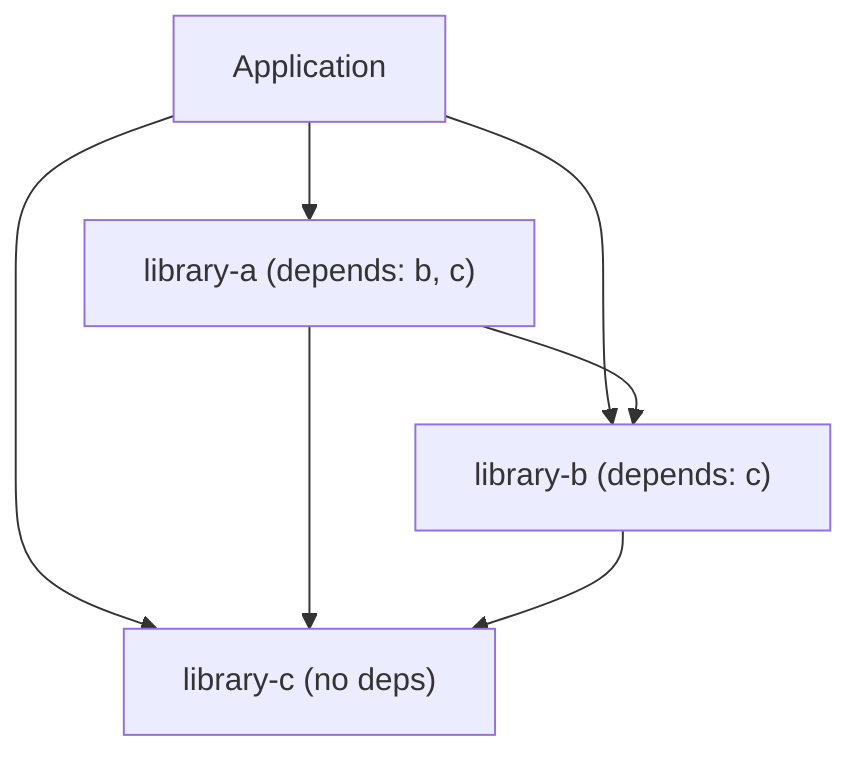

When an application has multiple libraries, the framework must wire them in dependency order — a library must be ready before any library that depends on it is wired. This is handled by `buildSortOrder()`.

## How it works

`buildSortOrder()` runs a topological sort on the libraries in `app.libraries`. It works by repeatedly finding the next library whose dependencies are all already in the output list:

```
Given: [A depends on C, B depends on C, C has no deps]
Step 1 → C has no deps, output it first: [C]
Step 2 → A and B both satisfied, output next available: [C, B]
Step 3 → A satisfied: [C, B, A]
```

The sort runs at boot, before any services are wired. Errors here are fatal and immediate.

## BAD_SORT — circular dependency

`BAD_SORT` is thrown when the sort cannot find a next library to load — which only happens when there's a cycle:

```
A depends on B
B depends on A
→ neither can be loaded first → BAD_SORT
```

**How to diagnose:** Look at which libraries are in the error's `current` list (already sorted) and which ones remain. The cycle is between the remaining libraries.

**How to fix:** Break the cycle. If A and B genuinely depend on each other, extract the shared functionality into a third library C that neither A nor B imports.

:::caution There is no lazy resolution
`BAD_SORT` is a hard error. The framework does not use proxies or deferred imports. Circular dependencies are detected immediately at boot and must be resolved structurally.
:::

## MISSING_DEPENDENCY — dependency object not resolvable

`MISSING_DEPENDENCY` is thrown when a library's `depends` entry could not be resolved to any object at all after the full membership closure is computed — meaning the library object was somehow not reachable through any path. This is rare in practice because `depends` itself transitively pulls dependencies into the wired set (closure-as-membership), so a `depends` entry that is a real imported singleton is auto-pulled.

`MISSING_DEPENDENCY` means "could not resolve to any object at all" — it is not triggered merely by omitting a library from the app's `libraries` array (closure-as-membership handles that). The auto-pulled libraries are narrated in the boot log.

`optionalDepends` entries are exempt — they log a message and continue if absent.

## Duplicate library names (`DUPLICATE_LIBRARY`)

A library is constructed once and held as a global singleton. The framework applies a fixed three-case rule:

1. **Declared in the app module** → it is authoritative.
2. **Exactly one instance exists anywhere** → it is used.
3. **Two distinct objects share the same name and neither is app-declared** → crash (`DUPLICATE_LIBRARY`).

The error states the fact only: `Duplicate library names detected: "<name>" (×N: copy#1 vs copy#2)`. The framework deliberately does not arbitrate between versions — the package manager owns that.

A diamond (the same singleton reached through multiple `depends` or group paths) is fine — identity dedup collapses it to one entry and boot emits a hygiene `warn`.



## Example dependency graph



Load order: `C` → `B` → `A` → Application services.
