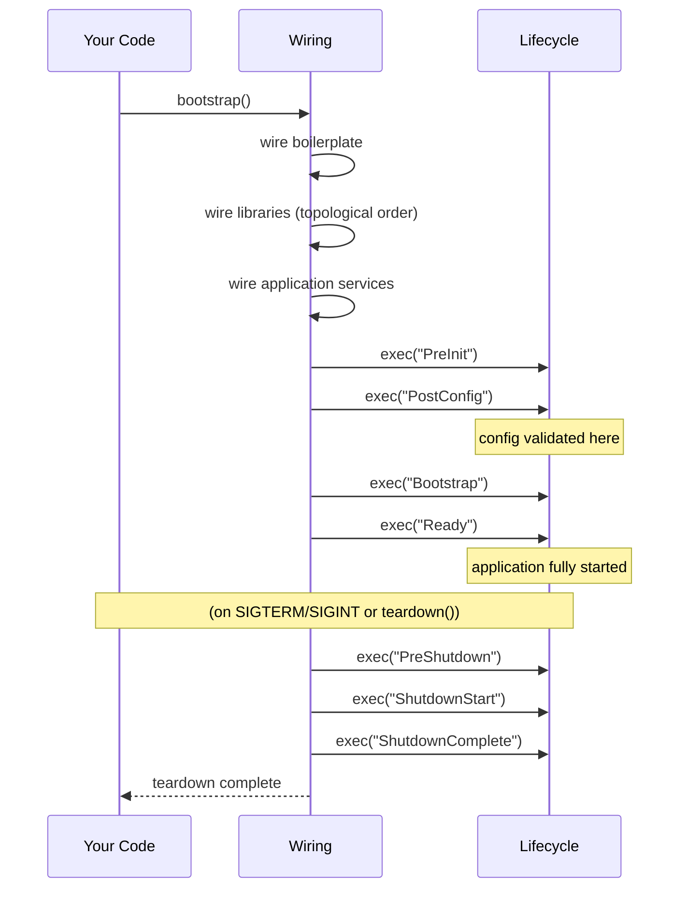

The lifecycle is a strictly ordered sequence of stages that runs during bootstrap and shutdown. Every service registers callbacks into these stages; the framework runs them in order, awaiting each stage before proceeding.

## LIFECYCLE_STAGES

```typescript
export const LIFECYCLE_STAGES = [
  "PreInit",
  "PostConfig",
  "Bootstrap",
  "Ready",
  "PreShutdown",
  "ShutdownStart",
  "ShutdownComplete",
] as const;
```

This is the canonical order. Shutdown stages run in the same array order as startup — `PreShutdown` before `ShutdownStart` before `ShutdownComplete`.

## Stage reference

| Stage | When | What's available | Typical use |
|---|---|---|---|
| `PreInit` | After wiring, before config | Logger, basic utils | Override config sources, very early setup |
| `PostConfig` | After config validated | All config values | Read config, initialize config-dependent state |
| `Bootstrap` | After PostConfig | Everything | Open connections, load data, start timers |
| `Ready` | After all Bootstrap callbacks | Everything | Start serving traffic, start scheduled jobs |
| `PreShutdown` | On SIGTERM/SIGINT | Everything | Stop accepting new work (close listeners) |
| `ShutdownStart` | After PreShutdown | Everything | Flush and close resources |
| `ShutdownComplete` | After ShutdownStart | Everything | Final best-effort cleanup |

## Full sequence



## What happens if a callback throws?

During startup stages (`PreInit` through `Ready`): the error is treated as fatal. Bootstrap halts and `process.exit(1)` is called.

During shutdown stages: the framework attempts to continue running remaining callbacks in the stage. Errors in shutdown are logged but do not halt the shutdown sequence.

## Late registration

If you register a callback for a stage that has **already completed**, the behavior depends on the stage:

- **Startup stages (PreInit → Ready):** Callback is called immediately.
- **Shutdown stages (PreShutdown → ShutdownComplete):** Callback is silently dropped.

This handles cases where services are created dynamically after initial boot.

## See also

- [Hooks](./hooks.md) — registration API for all seven stages
- [Execution Order](./execution-order.md) — priority semantics and parallel execution
