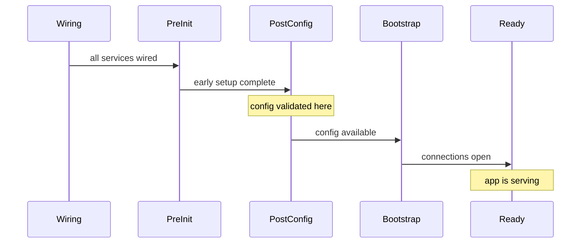

Every service function runs during wiring — once, early in bootstrap. But most real work can't happen at wiring time: config isn't validated yet, other services may not be wired yet, and you certainly can't open a database connection while the dependency graph is still being assembled.

Lifecycle hooks are how you say "run this code at this specific point in the boot sequence."

## The four startup stages



| Stage | When | What's available | Typical use |
|---|---|---|---|
| `PreInit` | After wiring, before config | Logger, basic utils | Override config sources, very early setup |
| `PostConfig` | After config is validated | Config values | Read config, initialize config-dependent state |
| `Bootstrap` | After PostConfig | Everything | Open connections, load data, set up resources |
| `Ready` | After all Bootstrap callbacks | Everything | Start serving traffic, start scheduled jobs |

## Using the hooks

```typescript
import type { TServiceParams } from "@digital-alchemy/core";

export function DatabaseService({ logger, lifecycle, config }: TServiceParams) {
  let client: DatabaseClient;

  lifecycle.onPostConfig(() => {
    // config.my_app.DATABASE_URL is available here
    logger.info({ url: config.my_app.DATABASE_URL }, "config loaded");
  });

  lifecycle.onBootstrap(async () => {
    // Open the connection
    client = await DatabaseClient.connect(config.my_app.DATABASE_URL);
    logger.info("database connected");
  });

  lifecycle.onReady(() => {
    // Everything is up — safe to start accepting work
    logger.info("database service ready");
  });

  return {
    query: async (sql: string) => client.query(sql),
  };
}
```

## Why the separation matters

Consider what happens if you try to read config at the top level of the service function:

```typescript
export function BadService({ config }: TServiceParams) {
  // ❌ Config is NOT validated yet at wiring time
  // This may return a default or be undefined
  const url = config.my_app.DATABASE_URL;

  return { url };
}
```

Config is collected and validated at `PostConfig`. At wiring time — when your service function body runs — config definitions have been registered but values from environment variables and config files haven't been applied yet. Only defaults are available.

The fix is simple: move the read into an `onPostConfig` or later callback.

```typescript
export function GoodService({ config, lifecycle }: TServiceParams) {
  let url: string;

  lifecycle.onPostConfig(() => {
    // ✅ Config is validated, all sources have been merged
    url = config.my_app.DATABASE_URL;
  });

  return { getUrl: () => url };
}
```

## Async bootstrap work

`onBootstrap` callbacks can be async. The framework awaits each callback before moving to the next stage:

```typescript
lifecycle.onBootstrap(async () => {
  await db.connect();           // framework waits for this
  await cache.warmUp();         // then this
  logger.info("ready to serve");
});
```

If a callback throws, bootstrap halts and the application exits with an error.

## Shutdown stages

Bootstrap has three startup stages and three matching shutdown stages. They run in reverse order when `SIGTERM`, `SIGINT`, or `app.teardown()` is called.

| Stage | Typical use |
|---|---|
| `PreShutdown` | Stop accepting new work (close server listeners) |
| `ShutdownStart` | Flush and close resources (db connections, queues) |
| `ShutdownComplete` | Final best-effort cleanup, log shutdown complete |

```typescript
lifecycle.onPreShutdown(() => {
  server.close(); // stop accepting new connections
});

lifecycle.onShutdownStart(async () => {
  await db.end();         // flush and close
  await queue.drain();    // drain pending work
});

lifecycle.onShutdownComplete(() => {
  logger.info("shutdown complete");
});
```

## Full hook reference

For all seven hooks with detailed descriptions, see [Hooks](../reference/lifecycle/hooks.md). For execution order within a stage (priority numbers, parallel vs serial), see [Execution Order](../reference/lifecycle/execution-order.md).

Next: [Typed Configuration →](./04-typed-configuration.mdx)
