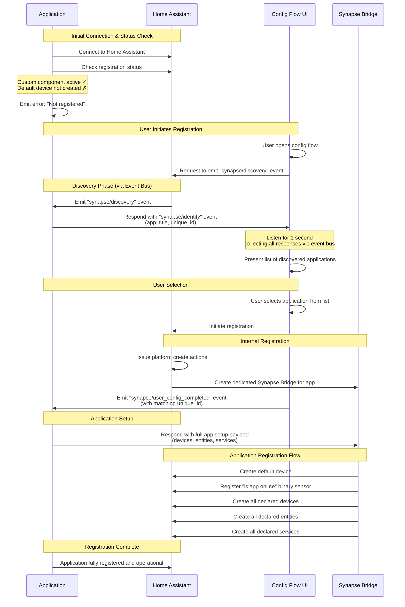

This document explains the complete flow for registering a synapse application with Home Assistant.

## Overview

When a synapse application first connects to Home Assistant, it must go through a registration process before it can create entities, devices, and services. This flow involves discovery, identification, user selection, and final setup.

## Registration Flow Diagram

## Step-by-Step Explanation

### 1. Initial Connection & Status Check

When the application starts, it connects to Home Assistant and checks its registration status:

- **Custom Component Status**: The application verifies that the synapse custom component is active in Home Assistant (assumed to be `true` for this flow)
- **Default Device Check**: The application checks if a default device has been created for this application (assumed to be `false` for new registrations)

If the application determines it is not registered, it will emit an error indicating it cannot proceed until registration is complete.

### 2. User Initiates Registration

The user must manually start the registration process through Home Assistant's UI:

- Navigate to **Settings** → **Devices & Services** → **Add Integration**
- Select **Digital Alchemy** (or the synapse integration name)
- This opens the configuration flow UI

### 3. Discovery Phase

Once the config flow is opened, the discovery process begins. Since the Synapse Bridge doesn't exist yet (the application isn't registered), all communication happens via the Home Assistant event bus:

1. **Discovery Request**: The config flow UI asks Home Assistant to emit a `"synapse/discovery"` event on the event bus
2. **Event Emission**: Home Assistant emits the `"synapse/discovery"` event on the event bus
3. **Application Reception**: All connected applications that are not yet registered listen on the event bus and receive the `"synapse/discovery"` event
4. **Application Response**: Applications respond by emitting a `"synapse/identify"` event on the event bus containing:
   - `app`: Application identifier
   - `title`: Display name for the application
   - `unique_id`: Unique identifier for this application instance
5. **Response Collection**: The config flow UI listens on the event bus for 1 second to collect all `"synapse/identify"` responses from applications
6. **List Presentation**: After the collection period, the UI displays all applications that responded to the discovery request

### 4. User Selection

The user selects the desired application from the list of discovered applications. This selection triggers the internal registration process.

### 5. Internal Registration

Home Assistant performs several internal operations:

- **Platform Actions**: Home Assistant issues platform create actions to set up the integration entry
- **Synapse Bridge**: A new, dedicated Synapse Bridge is created specifically for the selected application
- **Completion Event**: The config flow UI emits a `"synapse/user_config_completed"` event on the Home Assistant event bus with the matching `unique_id` of the selected application. The application receives this event via the event bus (direct messaging still not available at this point)

### 6. Application Setup

The application receives the `"synapse/user_config_completed"` event via the event bus and responds with its complete setup payload. Now that the Synapse Bridge exists, the application sends the payload directly to the bridge via WebSocket:

- All declared devices
- All declared entities (sensors, switches, etc.)
- All declared services
- Application metadata and configuration

### 7. Application Registration Flow

The Synapse Bridge receives the full setup payload and performs the following operations in order:

1. **Create Default Device**: A device is created to represent the application itself
2. **Register Binary Sensor**: An "is app online" binary sensor is created to track application connectivity
3. **Create Devices**: All devices declared by the application are registered
4. **Create Entities**: All entities declared by the application are registered
5. **Create Services**: All services declared by the application are registered

### 8. Registration Complete

Once all setup operations are complete, the application is fully registered and operational. It can now:

- Sync entity states with Home Assistant
- Respond to service calls
- Update entity configurations
- Create new entities dynamically

## Important Notes

- **Unique ID Stability**: The `unique_id` used during registration should remain stable across application restarts. It's recommended to set `METADATA_UNIQUE_ID` in your application configuration to ensure consistency.

- **Multiple Applications**: Multiple applications can be registered to the same Home Assistant instance. Each application maintains its own Synapse Bridge and device registry.

- **Re-registration**: If an application is already registered, it will skip the discovery phase and connect directly using its existing registration.

- **Error Handling**: If registration fails at any step, the application will remain in an unregistered state and will need to go through the flow again.
