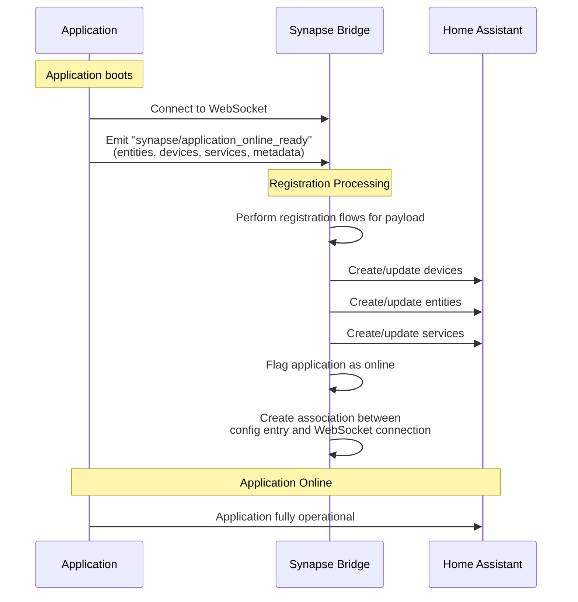
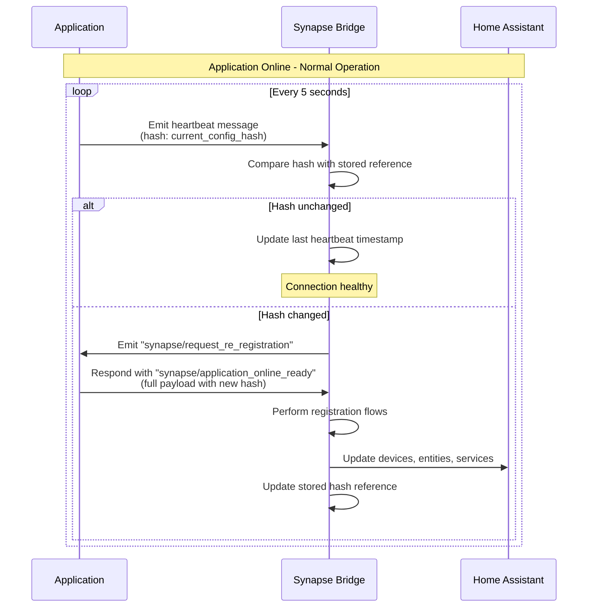
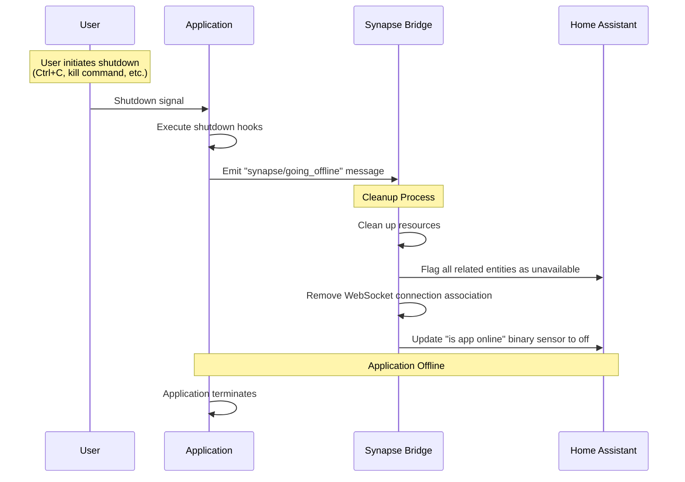
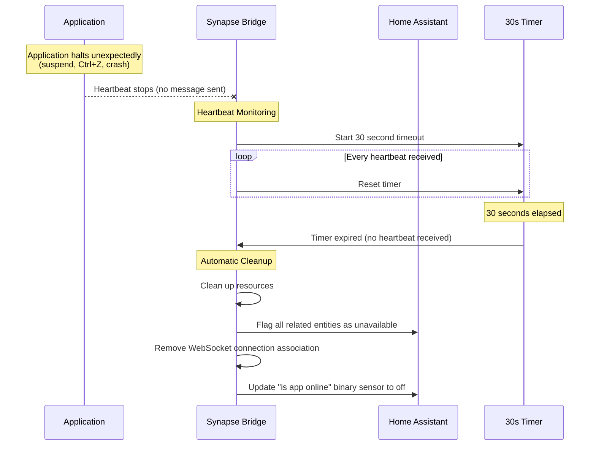
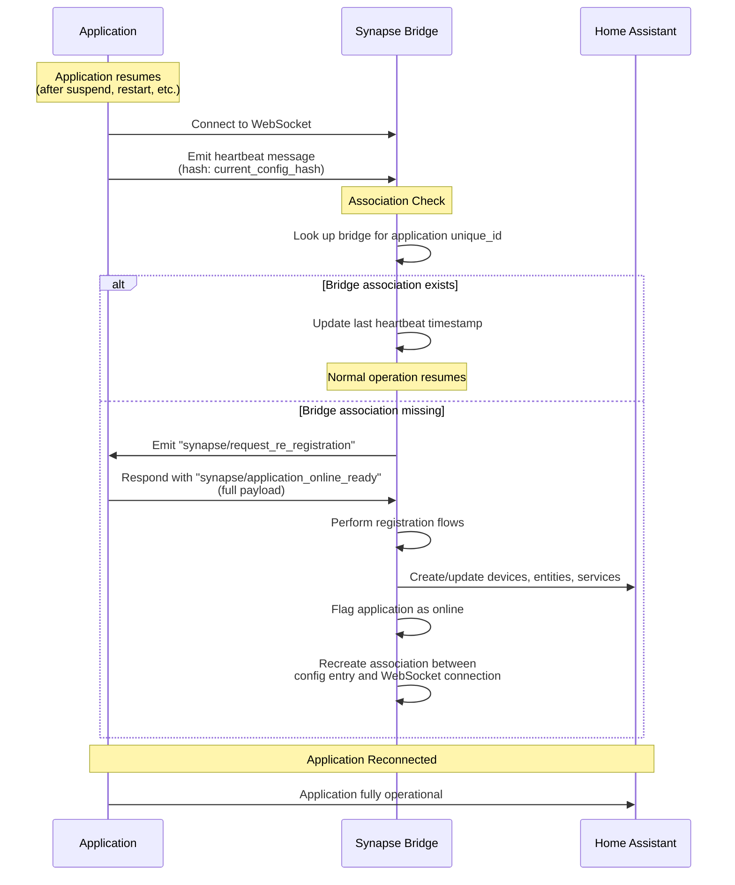

This document explains how synapse applications maintain their connection to Home Assistant, handle availability states, and recover from disconnections.

## Overview

Once an application is registered with Home Assistant, it must maintain an active connection and periodically communicate its status. The integration tracks application availability through heartbeat messages and handles both planned and unplanned disconnections. This ensures that entity states accurately reflect whether the application is online and capable of responding to requests.

## Initial Connection Flow

When an application boots and connects to Home Assistant, it immediately signals that it's ready to operate:

### Step-by-Step: Initial Connection

1. **Application Boot**: The application starts and establishes a WebSocket connection to its dedicated Synapse Bridge.

2. **Online Ready Message**: The application immediately emits a `"synapse/application_online_ready"` message containing:
   - All declared entities and their configurations
   - All declared devices
   - All declared services
   - Application metadata (unique_id, title, etc.)

3. **Registration Processing**: The Synapse Bridge receives the payload and:
   - Performs registration flows to create or update all declared resources
   - Creates or updates devices in Home Assistant
   - Creates or updates entities in Home Assistant
   - Creates or updates services in Home Assistant

4. **Online Status**: The integration:
   - Flags the application as online
   - Creates an association between the application's config entry and the active WebSocket connection
   - Updates the "is app online" binary sensor to `on`

5. **Operational**: The application is now fully operational and can sync states, respond to service calls, and update configurations.

## Heartbeat Mechanism

Once online, the application continuously sends heartbeat messages to maintain the connection and detect configuration changes:

### Step-by-Step: Heartbeat Flow

1. **Periodic Heartbeats**: Every 5 seconds, the application emits a heartbeat message containing a `hash` property that represents the current configuration state (entities, devices, services).

2. **Hash Comparison**: The integration compares the received hash with the stored reference hash from the last `application_online_ready` message.

3. **Hash Unchanged**: If the hash matches:
   - The integration updates the last heartbeat timestamp
   - The connection is considered healthy
   - No further action is taken

4. **Hash Changed**: If the hash differs:
   - The integration emits a `"synapse/request_re_registration"` message to the application
   - The application responds by sending a new `"synapse/application_online_ready"` message with the full payload
   - The integration performs registration flows to update all resources
   - The stored hash reference is updated to the new value

This mechanism ensures that any configuration changes (new entities, removed devices, service updates, etc.) are automatically synchronized with Home Assistant without requiring manual intervention.

## Going Offline

Applications can go offline through two distinct paths: planned shutdowns and unplanned halts. Each path is handled differently:

### Planned Shutdown

When a user intentionally stops the application (e.g., Ctrl+C), the application can cleanly signal its departure:

### Unplanned Halt

When an application stops unexpectedly (e.g., system suspend, Ctrl+Z, crash), no shutdown message is sent. The integration detects this through heartbeat timeout:

### Step-by-Step: Going Offline

#### Planned Shutdown

1. **User Action**: User initiates shutdown through terminal (Ctrl+C), system service stop, or application exit.

2. **Shutdown Hooks**: The application executes its shutdown hooks, which include:
   - Emitting the `"synapse/going_offline"` message
   - Cleaning up internal resources
   - Gracefully closing connections

3. **Integration Response**: The integration receives the `"synapse/going_offline"` message and:
   - Immediately cleans up resources associated with the application
   - Flags all related entities as unavailable in Home Assistant
   - Removes the association between the config entry and WebSocket connection
   - Updates the "is app online" binary sensor to `off`

4. **Termination**: The application completes shutdown and terminates.

#### Unplanned Halt

1. **Unexpected Stop**: The application stops without executing shutdown hooks (system suspend, process kill, crash, etc.).

2. **Heartbeat Monitoring**: The integration maintains a 30-second timer that tracks the time since the last heartbeat message.

3. **Timer Reset**: Each time a heartbeat is received, the timer is reset to 30 seconds.

4. **Timeout Detection**: If 30 seconds elapse without receiving a heartbeat:
   - The integration assumes the application is offline
   - Automatic cleanup is triggered

5. **Automatic Cleanup**: The integration performs the same cleanup operations as planned shutdown:
   - Cleans up resources
   - Flags entities as unavailable
   - Removes WebSocket connection association
   - Updates the "is app online" binary sensor to `off`

## Reconnection Flow

When an application comes back online after being offline, it must re-establish its connection. If the integration has lost the association (e.g., after a 30-second timeout), it will request re-registration:

### Step-by-Step: Reconnection

1. **Application Resumes**: The application restarts or resumes from a suspended state and reconnects to the WebSocket.

2. **Heartbeat Sent**: The application sends a heartbeat message as part of its normal operation.

3. **Association Check**: The integration attempts to find the bridge association for the application's `unique_id`.

4. **Association Exists**: If the association is found:
   - The integration updates the last heartbeat timestamp
   - Normal operation resumes without additional steps

5. **Association Missing**: If no association is found (e.g., the integration cleaned up after a 30-second timeout):
   - The integration emits `"synapse/request_re_registration"` to the application
   - The application responds with a full `"synapse/application_online_ready"` message
   - The integration performs registration flows to recreate all resources
   - The application is flagged as online
   - The association between config entry and WebSocket connection is recreated

6. **Operational**: The application is fully reconnected and operational.

## Important Notes

- **Heartbeat Interval**: Applications send heartbeat messages every 5 seconds. This interval balances responsiveness with network efficiency.

- **Timeout Duration**: The integration uses a 30-second timeout to detect unplanned disconnections. This duration allows for brief network interruptions without triggering false offline states.

- **Hash Calculation**: The hash in heartbeat messages should represent the complete configuration state. Any change to entities, devices, or services should result in a different hash value.

- **Entity Availability**: When an application goes offline (planned or unplanned), all related entities are immediately flagged as unavailable. This prevents Home Assistant from attempting to call services on unavailable applications.

- **Reconnection Resilience**: The reconnection flow ensures that applications can recover from temporary disconnections without requiring manual re-registration through the config flow UI.

- **Multiple Applications**: Each application maintains its own heartbeat and timeout tracking. One application going offline does not affect others.

- **WebSocket Stability**: The WebSocket connection itself may be interrupted by network issues. The application should handle reconnection at the WebSocket level and then proceed through the reconnection flow described above.
