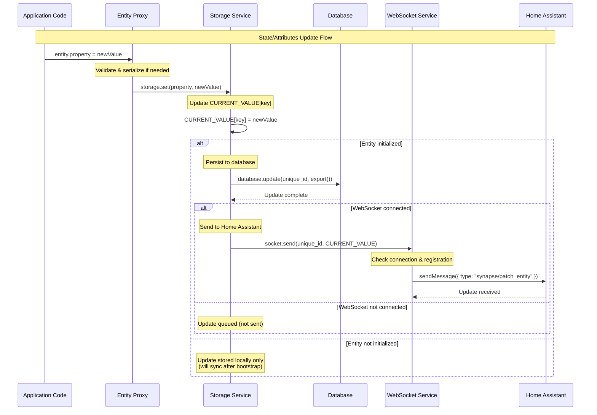
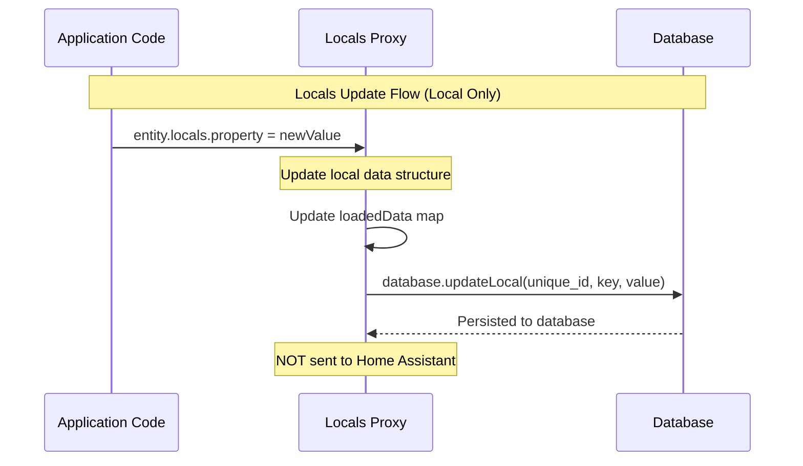

This document explains how entity state changes propagate through the synapse system, from application code to Home Assistant, including the distinction between state/attributes (which are synced) and locals (which remain local only).

## Overview

When you update an entity's state or attributes in your application code, the change flows through several layers before reaching Home Assistant. The system maintains a local database for persistence and uses WebSocket communication to sync changes with Home Assistant. Locals, on the other hand, are stored locally and never sent to Home Assistant.

## State & Attributes Propagation Flow

State and attributes are properties that Home Assistant needs to track. When these are updated, they flow through storage, database persistence, and WebSocket communication:



## Locals Propagation Flow

Locals are application-specific data that persist across reboots but are never sent to Home Assistant. They use a separate storage mechanism:



## Step-by-Step Explanation

### State & Attributes Updates

1. **Application Code Update**: Your code assigns a new value to an entity property:
   ```typescript
   mySwitch.is_on = true;
   mySensor.current_temperature = 72.5;
   ```

2. **Entity Proxy Interception**: The entity proxy's `set` trap intercepts the assignment:
   - Validates the property if a domain-specific validator is provided
   - Serializes the value if a domain-specific serializer is provided
   - Checks if the property is a stored property (state/attributes)

3. **Storage Service Update**: The proxy calls `storage.set(property, newValue)`:
   - Updates the in-memory `CURRENT_VALUE` object
   - If the entity is initialized (after bootstrap), proceeds to persistence

4. **Database Persistence**: The storage service calls `synapse.database.update()`:
   - Exports the current state as a JSON object
   - Updates the database row for this entity's `unique_id`
   - The database stores the complete current state, not just the changed property

5. **WebSocket Communication**: If the WebSocket is connected:
   - The storage service calls `synapse.socket.send(unique_id, CURRENT_VALUE)`
   - The socket service validates:
     - Application is not going offline
     - WebSocket connection is active
     - Application is registered with Home Assistant
   - Sends a `"synapse/patch_entity"` message containing:
     - `unique_id`: The entity's unique identifier
     - `data`: The complete current state object (all properties)

6. **Home Assistant Reception**: Home Assistant receives the patch message and updates the entity's state/attributes accordingly.

### Locals Updates

1. **Application Code Update**: Your code assigns a value to a locals property:
   ```typescript
   mySensor.locals.lastMaintenance = Date.now();
   mySwitch.locals.customFlag = true;
   ```

2. **Locals Proxy Interception**: The locals proxy's `set` trap intercepts the assignment:
   - Updates the local data structure
   - Stores the value in the `loadedData` map

3. **Database Persistence**: The locals proxy calls `synapse.database.updateLocal()`:
   - Persists the key-value pair to the database
   - Uses a separate table/collection from entity state
   - Tracks values by `unique_id` and property `key`

4. **No Home Assistant Communication**: Locals are **never** sent to Home Assistant. They remain local to your application and persist across reboots for your application's internal use only.

## Important Notes

### Order of Operations

For state/attributes updates, the order is:
1. In-memory update (`CURRENT_VALUE[key] = value`)
2. Database persistence (`database.update()`)
3. WebSocket transmission (`socket.send()`) - only if connected

The database update happens synchronously, but the WebSocket send is queued via `setImmediate()` to avoid blocking.

### Initialization State

- **Before Bootstrap**: If an entity is updated before the bootstrap phase completes, the change is stored in memory but not persisted or sent. After bootstrap completes and data is loaded from the database, the entity becomes "initialized" and subsequent updates will propagate fully.

- **After Bootstrap**: Once initialized, all updates immediately flow through the complete pipeline: memory → database → WebSocket (if connected).

### Connection State Handling

- **Connected**: Updates are immediately sent to Home Assistant via WebSocket
- **Disconnected**: Updates are stored in the database but not sent. When the connection is restored, the current state will be synced during the next heartbeat or registration flow.

### Database vs WebSocket

- **Database**: Stores the complete current state as a JSON object. Used for persistence across reboots and state restoration.
- **WebSocket**: Sends the complete current state object to Home Assistant. The Python synapse extension receives this and applies it to the entity in Home Assistant.

### Locals vs State/Attributes

- **State/Attributes**: Tracked by Home Assistant, synced via WebSocket, stored in the main entity state table
- **Locals**: Application-only data, never sent to Home Assistant, stored in a separate locals table, persist across reboots for application use

### Reactive Configuration

Some entity properties use reactive configuration (functions that compute values based on other entities). These are handled separately:
- They update automatically when referenced entities change
- They run on a schedule (default: every 30 seconds) to ensure accuracy
- They follow the same propagation flow once their computed value changes
