Most entity domains support at least 1 service with the entity being the target.
These service calls are what Home Assistant uses to communicate that state needs to change:

- `switch.turn_on`
- `select.select_option`
- `number.set_value`
- ... etc

## Differences vs hass events

It is important to realize that events coming from `synapse` are not equivalent to those being emitted by `hass`.
They have very different implications.

> This creates a new `My Switch` entity, and does a lookup by it's entity id via `hass`

```typescript
import { TServiceParams } from "@digital-alchemy/core";

export function ExampleService({
  hass,
  synapse,
  logger,
  context,
}: TServiceParams) {
  const mySynapseSwitch = synapse.switch({
    context,
    name: "My Switch",
  });

  const myHassSwitch = hass.refBy.id("switch.my_switch");
}
```

### Hass Events

The `hass` entity proxy will emit events when the entity has **ALREADY CHANGED**.

Internally the library has already processed the state change, updated it's internal caches, and finally emitted an event to notify you that something happened

```typescript
myHassSwitch.onUpdate((new_state, old_state) => {
  // Everything is changed
  logger.info(`${new_state.state} === ${myHassSwitch.state}`);
});
```

### Synapse Events

The `synapse` events have entirely different set of implications.

These are run in response to Home Assistant saying "please run this command", they are not an indication of a change in state.

> The workflow for how

```typescript
// 1) emit service call
hass.call.switch.turn_on({ entity_id: "switch.my_switch" });

// 2) HA relays that turn_on command to synapse
mySynapseSwitch.onTurnOn(() => {
  logger.info("synapse received turn on command");

  // 3) (handled by library internals) value is updated
  mySynapseSwitch.is_on = true;
});

// 4) updated state value is received
myHassSwitch.onUpdate((new_state) => {
  logger.info(`switch is now ${new_state.state}`); // switch is now on
});
```



```mermaid
sequenceDiagram
    participant App as Your Application
    participant HA as Home Assistant
    participant Synapse as Synapse Entity

    rect rgb(88, 0, 0)
        Note over App,HA: hass
        App->>HA: 1) Service Call
        Note over App,HA: switch.turn_on
        HA->>HA: Optimistic updates
    end

    rect rgb(21, 0, 116)
        Note over HA,Synapse: synapse
        HA->>Synapse: 2) Relay turn_on command
        Note right of Synapse: Command received
        Synapse->>App: 3) onTurnOn() event
        Note left of App: Event handler fires
        App->>Synapse: Update state (is_on = true)
        Note right of Synapse: State updated
    end

    rect rgb(88, 0, 0)
        Note over Synapse,HA: hass
        Synapse->>HA: 4) Send state update
        HA->>HA: Process state change
        Note over HA: Internal processing
        HA->>App: 5) onUpdate() event
        Note left of App: State change confirmed
    end
```

### Synapse onUpdate

In order to receive events on your synapse entity, you need to attach to the `.onUpdate` callback.
These all share the same syntax and run at the same time

```typescript
// traditional bindings
myHassSwitch.onUpdate((new_state) => {})

// create a hass entity and attach update to that
mySynapseSwitch.getEntity().onUpdate((new_state) => {})

// runs in response to same update
mySynapseSwitch.onUpdate((new_state) => {});
```

## Handling Service Calls

### Managed Services

The default operation for **ALL** synapse entities to automatically handle these service calls for you.
You can disable this functionality per-entity by adding `managed: false`.

```typescript
const unManagedSensor = synapse.sensor({
  context,
  name: "UnManaged Sensor",
  managed: false, // <<< this disables automatic state management
});
```

If you do nothing else, Home Assistant will have some weird effects via **Optimistic Updates**.
Entities have their state changed within HA prior to actually receiving that update from synapse.

Entitites will temporarily turn_on, then revert back to the reported state if your app doesn't update.

### Syntax

Attaching your own events can be done in 2 ways: as part of the entity definition, and as a chained callback.

```typescript
const specialSwitch = synapse.switch({
  context,
  name: "Special Switch",
  managed: false,
  turn_on() {
    logger.info("received turn_on");
  }
});

specialSwitch.onTurnOn(() => {
  logger.info("this is the same thing");
});
```
